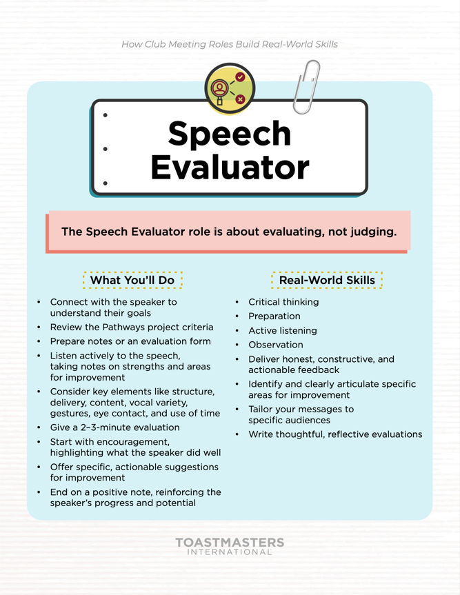

# Evaluator

## Description

The evaluator evaluates speaker's speech. An evaluation normally consists of three main objectives.

- Encourage the speaker.
- Highlight what the speaker does well.
- Provide constructive suggestions on what you think would improve the speech.

Before the speech, review the overall objectives of the speech, presentation, or other(refer to the pathway of the
speaker).

## Evaluation

If the speaker desires to have a written evaluation, you will be provided with an evaluation form specific to the
objectives of the particular speech.

It's often best to just make notes during the actual speech. Given that you, as evaluator, only have 2 to 3 minutes to
later deliver your verbal evaluation to the audience, it can be easier to refer to your notes when speaking to the
audience. Later, you can complete the written evaluation(if requested) and give it to the speaker either in person or
forwarded online.

## Pathways Projects - What to Look and Listen for

Each project has its own set of objectives. Some have more than others. Toastmasters often comment on three items in the
positive feedback portion of the evaluations. These are things that the speaker did well. After that, you can provide
suggested improvements. One suggestion is usually enough but no more than three. Close your evaluation with a comment
that is positive.

It you don't see an area for a suggested improvement, that is fine. Instead, report on what you do see and hear. Perhaps
the speaker does something that is distracting, such as:

- makes a repetitive gesture or phrase unnecessarily, or
- fidgeting in someway

You may also see that there are two or three areas of speaking that you notice more than others. It could be body
language, vocal variety, eye contact with the audience, or something else. These can be part of an evaluation that gives
you an opportunity to provide positive feedback, or a suggested improvement.

<b>Your goal is to provide the greatest benefit to the speaker.</b>

## Performing the Evaluation

As an evaluator, it is beneficial for you to evaluate different speakers over time. You weill notice and learn how
speakers approach and deliver projects differently.

The evaluation is a key element in toastmasters. It's a skill that develops over time.

However, if you are a new member, you may feel uncomfortable or unqualified to evaluate experienced speakers. you may
feel too intimidated to try. In this case you will miss the opportunity to improve your evaluation skills.

Don't be intimidated. Experienced members are not always looking for tips on technical skills. They are seeking feedback
on the content of their speech. Remember, you are providing your unique perspective as an evaluator and can offer new
insights.

Remember you only have 2 to 3 minutes to give your evaluation. Usually you will be called on to speak in front the
audience. Over time, try to refer to your notes less and less while presenting your evaluation.
