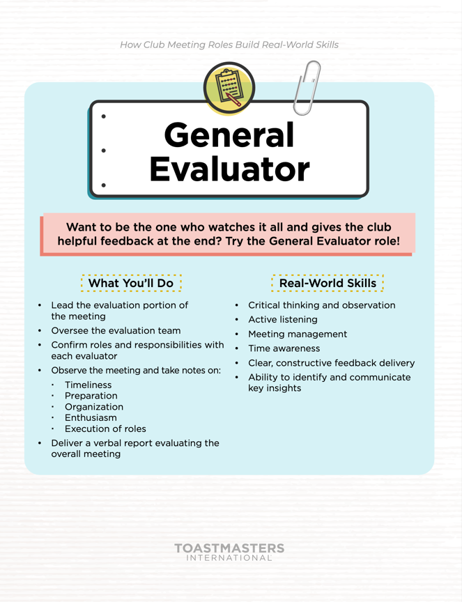

# General Evaluator

## Overview 

## Description

The general evaluator evaluates everything that takes place during the club meeting. In addition, the general evaluator
conducts the evaluation portion of the meeting and is responsible for the evaluation team: the speech evaluators, ah
-counter, grammarian and timer. As general evaluator, you should do the following:

- Ensure other evaluators know their tasks and responsibilities.
- Explain the purpose and benefits of evaluations to the group/
- Identify and confirm meeting assignments with the timer, grammarian and ah-counter.
- Confirm the club meeting program and/or checklist with the toastmaster.
- During the meeting, take notes and report on all club proceedings to evaluate things such as timeliness, enthusiasm,
  preparation, organization , performance of duties, etc.

The general evaluator manages the following sessions during the meeting:

- [Toastmaster session](#toastmaster-session)
- [Evaluation session](#evaluation-session)

## Toastmaster Session

When introduced by the Toastmaster, please state the following:

> Thank you, Mr and Madam toastmaster. Good evening fellow toastmasters and guests. The purpose of the general evaluator
> is to evaluate everything that takes place throughout the meeting.
>
> During the meeting, I will take notes on everything that happens and doesn't happen. I will evaluate each participant
> and look for good examples of preparation, organization, delivery, enthusiasm, observation, and performance of duties.
> At the end of the meeting, I will give my report.
>
> It is also my pleasure to introduce our evaluation team at this time.

Introduce the evaluation team.

> Tonight in the role of Grammarian is `<name>`. Please introduce the role of grammarian.

The grammarian introduces his/her role and responsibilities. Afterward, returns control back to the general evaluator.

> In the role of timer is `<name>`. Please introduce the role of timer.

The timer introduces his/her role and responsibilities. Afterward, returns control back to the general evaluator.

> In the role of ah-counter is `<name>`. Please introduce the role of ah-counter.

The ah-counter introduces his/her role and responsibilities. Afterward, returns control back to the general evaluator.

> In the role of ballot-counter is `<name>`. Please introduce the role of ballot-counter.

The ballot-counter introduces his/her role and responsibilities. Afterward, returns control back to the general
evaluator.

> This concludes my introduction and that of my evaluation team for tonight's meeting. I now return control of the
> meeting to our chairperson `<name>`. Thank you.

## Evaluation Session

When it's time for the evaluation session to begin, the chairperson calls on the general evaluator to introduce the
evaluation team to deliver their reports.

### Introducing Speech Evaluators

Up to three speech evaluators may be called.

> Our first evaluator is `<name>` who will evaluator the speech given by `>name>`. Please begin your evaluation when you
> are ready. Your evaluation time is 2 to 3 minutes. Let the timer know you are starting. Thank you.

Repeat this step until all the evaluators give their evaluations. At the conclusion of the speech evaluations, the
general evaluator thanks the speech evaluators.

> It's my pleasure to now bring back our role takers to deliver their reports.

> Our first report is from our grammarian `<name>`. Please give us your report.

The grammarian gives their report.

> Our next report is from timer `<name>`. Please give us your report.

The timer gives their report.

> Our next report is from ah-counter `<name>`. Please give us your report.

At the end of the reports, the general evaluator thanks the role takers.

> I will now deliver my report as general evaluator. Timer please start timing now.

Now, give your report as the general evaluator. Afterward, return the control back to the chairperson.

> This concludes the evaluation session. I now return control back to our chairperson.
