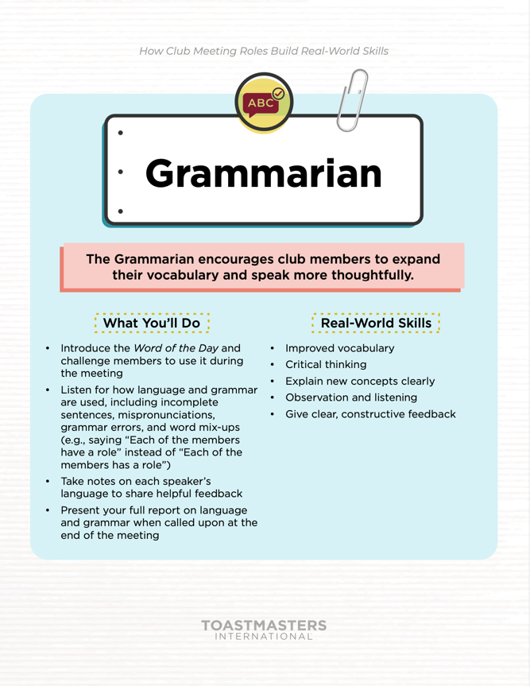

# Grammarian

## Overview 

## Description

The Grammarian role helps members enhance their language skills by introducing a Word of the Day to expand
vocabulary and encouraging its use during the meeting. They listen carefully to all speeches, noting both excellent
language usage and areas for improvement in grammar or phrasing. At the end of the meeting, they provide constructive
feedback and highlight exemplary use of language.

## Introduce the Word of the Day

When introduced by the general evaluator, please state the following description of the grammarian's role.

> Mr/Madam toastmaster, fellow toastmasters, and guests. As grammarian, it's my responsibility to pay close attention to
> all speakers, listening carefully to their language usage. I'll take note of any improper language, as well as any
> interesting words, quotes, sayings or thoughts. As grammarian, it's also my duty to introduce the word of the day.
>
> For today's meeting, the word is `<word of the day>`, which means `<meanings`>. An example sentence using the word is
`<example>`. Each speaker is encouraged to use the word of the day. I will give the grammarian's report when called upon
> later during the meeting and also report on the usage of the word of the day.
>
> Thank you, I now return control of the meeting back to the general evaluator.

## Grammarian Report

You will be called by the general evaluator to give the grammarian's report.

### Language Usage

| Words (Interesting, Unusual, or Others) | Quotes, Sayings, Thoughts | Notes on Grammar or Language (Good Use or Usage That Could Be Improved) |
|-----------------------------------------|---------------------------|-------------------------------------------------------------------------|
| Word 1                                  | Quote 1                   | Note 1                                                                  |
| Word 2                                  | Quote 2                   | Note 2                                                                  |
| Word 3                                  | Quote 3                   | Note 3                                                                  |
| Word 4                                  | Quote 4                   | Note 4                                                                  |
| Word 5                                  | Quote 5                   | Note 5                                                                  |

### Word of Day Usage 

| Name  | Count |
|-------|-------|
| Name1 | 1     |
| Name2 | 2     |
| Name3 | 3     |
| Name4 | 4     |
| Name5 | 5     |
