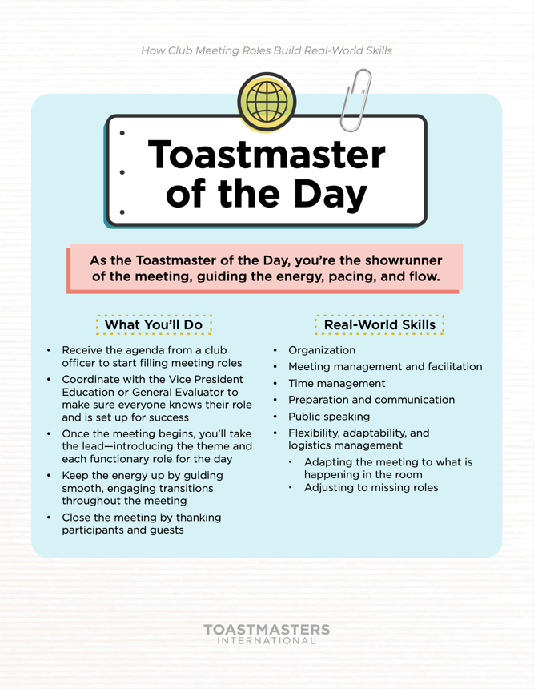

# Toastmaster

## Overview 

## Description

The toastmaster manages the following sessions during the meeting:

- [Toastmaster Session](#table-topic-session)
- [Prepared Speech Session](#prepared-speech-session)
- [Table Topic Session](#table-topic-session)
- [Evaluation Session](#evaluation-session)
- [Award & Recognition Session](#award--recognition-session)

## Toastmaster Session

When introduced by the president(or chairperson), please state the following

> Mr./Madam president, fellow toastmasters and guests. I will be your toastmaster for today's meeting. The role of the
> toastmaster is to act as the MC for the meeting, introducing the various sessions throughout the meeting. At the
> conclusion of the meeting, I will return control to the president(or chairperson if the president is not present).

Pause briefly 😮‍💨

> At this time, it's by pleasure to introduce our `General Evaluator` `<name>` who will introduce today's evaluation
> team.

General Evaluator takes control of the meeting from the toastmaster. After the general evaluator completes the
introduction of the evaluation team, control is passed back to the toastmaster.

## Prepared speech session

In this session, there can be up to 3 speakers for the meeting. Adjust the introduction according to the number of
speakers for this meeting.

> Tonight we have `<number>` of speakers. Each speaker has a speech evaluator who will tell us a little about the speech
> and the speaker.

#### Introduce evaluator

> Our first evaluator is `<name>`. Please introduce your speaker and their speech. Thank you.

The evaluator tells the audience the speech path, level, title and length of the speech.

Then the toastmaster thanks the evaluator and then introduces the speaker by <b>name -> speech title -> speech title ->
name</b>. For example

- Seon Woo Kim
- My Ice Breaker(pause for a while) 😮‍💨
- My Ice Breaker
- Seon Woo Kim

The speaker gives their speech and hands control back to the toastmaster.

> We will now have 1 minute and 30 seconds of silence. Please submit your feedback for the speaker on the online form we
> have provided.
> Timer let us know when time is up.

Pause for a while 😮‍💨

Now repeat from [above](#introduce-evaluator) until whole speakers deliver their speech.

After all Speakers delivered their speech

> That concludes our speeches for this meeting. Now I ask our timer to share with us the amount of time for each speech.

The <b>timer</b> provides the speech times and passes control back to the toastmaster.

> Please vote for the best speaker.

After all votes are submitted, announce break time.

> We will now have a 10 minutes break. Don't forget to pay the room fee. Thank you.

## Table Topic Session

Introduce table topic master and table topic master will lead the session.

> It's now my pleasure to introduce our <b>table topic master</b>, `<name>`. 

When table topic concludes, the table topic master returns control of the meeting to the toastmaster.

## Evaluation Session

Introduce the general evaluator who will lead the evaluation session.

> It's now my pleasure to introduce our general evaluator, `<name>`.

When the evaluation session concludes, the general evaluator returns control of the meeting to the toastmaster.

## Award & Recognition Session

The toastmaster takes control of the meeting to introduce the best speaker, the best evaluator, and best table topic
speaker(the ballot counter will let you who to announce). We provide ribbons for the winners of each session and take
pictures.

> Hello again, I hope everyone has been enjoying the meeting. I will now introduce our best speaker, the best evaluator, and
> best table topic speaker. Are you ready?

> Our best speaker is `<name>`. 🥳 🥳 🥳

> Our best evaluator is `<name>`. 🥳 🥳 🥳

> Our best table topic speaker is `<name>`. 🥳 🥳 🥳

If there are speakers who have delivered their first ice breaking speech, congratulate their first speech with icebreaker ribbon.

> Today `<name>` has deliverd his/her best ice breaking speech. Please congratulate him/her. 

If there are first time guests, give them welcome ribbons. 

> Today `<name>` has visited HDTM for the first time. Let's thank him/her for participating today's meeting.

Now return the control back to the president(or chairperson if the president is not present)

> I now return control back to our president.
